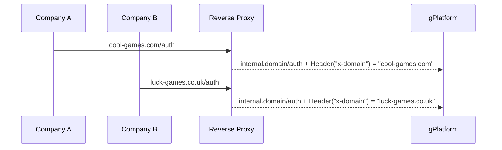

# Turning a single consumer web-based Platforms into a SaaS
A web-based gaming platform (=gPlatform) is currently providing it’s services to one single gaming site (=gSite).
The services provided by gPlatform to gSite include hosting web-games and backoffice for managing players that sign-up and play on gSite.

We want to make gPlatform into a SaaS that can be sold to other gaming sites as subscription-based service.

Each new gaming company operating a gaming site, will have it’s own dedicated domain - for example:
Company A will have a domain cool-games.com
Company B will have a domain luck-games.co.uk 
etc

Currently at gPlatform, users are identified by using email as a unique key. 

# Give a short, clear explanation for every question below:
1. How can we design the system in a way that every Company will be able to serve games on their gaming site from their domain?
2. What modification should be done to the users table at gPlatform to support this change? 
3. Considering we have 1 backend cluster that serves all companies, how can we validate a user login on one gaming domain in such a way that it does not give access to a different gaming domain? (i.e. authenticating on site A, grants access to site A only)

# Responses:

gPlatform should configure its edge router (or reverse proxy) that every single domain it hosts should add header
in the request to the backend service.
  

gPlatform should add extra field "domain" into the users table. Composite key [ "domain", "email" ] should be set as unique key.
There should be migration on the database to add domain to current users of gSite.

If the gPlatform uses JWT tokens add the domain inside JWT. Match the token with the x-domain header
upon authorization and use it to limit access to services only for "Site A". 

If the gPlatform uses a random token stored somewhere in memory database (like Redis) should consider extending the token record
with the domain field and inject it into the http request upon authentication.
